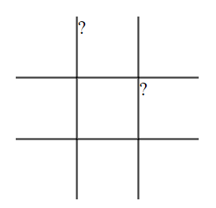

# DOM project

En aquesta activitat crearàs un joc el DOM, HTML i CSS.

## Objectius

- Manipular el DOM directament, afegint i eliminant elements.
- Fer servir CSS per donar estils als elements de la pàgina.
- Afegir gestors d'esdeveniments (event handlers) per interactuar amb les accions que l'usuari faci a la pàgina.
- Gestionar les dades del joc de manera ordenada i estructurada, separades de la visualització
- Implementar la lògica de funcionament del joc de manera ordenada i estructurada, dividint el codi en tantes funcions com calgui.
- Separar la lògica de funcionament del codi de la visualització.

## Configuració

- `npm install` per instal·lar Tailwind CSS.
- `npm start` per a inicialitzar el compilador de Tailwind CSS.
- Obre `index.html` al navegador amb el Live Server de VS Code.

## Requisits bàsics

- Escull un dels següents jocs i desenvolupa'l utilitzant tot el que has après de HTML, CSS, JavaScript i el DOM.
- Si ho prefereixes, pots fer un altre joc que no estigui en aquesta llista

### Tres en ratlla

### 1. Estila el taulell

- [ ] Afegeix el CSS necessari
  - El taulell hauria d'estar centrat a la pàgina
  - Treu els costats innecessaris
  - Aproxima't el que puguis al clàssic taulell de tres en ratlla



- [ ] Afegeix contingut al taulell
  - Utilitza pseudoelements per afegir X i O a les caselles
  - Haurien d'estar el més centrats possible
  - In the input.css file, you have the following: 
    ```css
    
      .x::after {
        content: '?'
      }
      .o::after {
        content: '?'
      }
    ```
    Please, replace this in the way it looks like the image bellow.

     

- [ ] Centrilize icons ❌ and ⭕
  - Add a flexbox on ```css.grid-cell  ``` class, in order for the items to be centralized. Adjust also the font-size, to look like the image bellow.

     


### 2. Afegeix funcionalitat

- [ ] Afegeix funcionalitat
  - Programa un click event al grid per marcar les caselles
  - Afegeix les comprovacions necessàries (empat, guanyador)
  - Fes el botó de reset funcional
       

- [ ] Acaba d'estilar el joc
  - Estila la pantalla de 'final del joc'
  - Assegura't que el botó de reset apareix al final del joc

### Snake game

TODO: write instructions.

A snake game using canvas and P5 by Germinal: all that needs to be done is replace the draw() functions by DOM instead of p5.js: <https://github.com/CodeOp-tech/FE-CAT-snake-p5>

### Add more games... (chess? checkers? minesweeper?)

TODO

## Recursos

- [MDN - Manipulating the DOM Guide](https://developer.mozilla.org/en-US/docs/Learn/JavaScript/Client-side_web_APIs/Manipulating_documents)
- [Plain JS - Common DOM Manipulation methods](https://plainjs.com/javascript/manipulation/)
- [Eloquent JavaScript - The DOM](https://eloquentjavascript.net/14_dom.html)
- [Eloquent JavaScript - Handling Events](https://eloquentjavascript.net/15_event.html)

## Notes

_Aquest és un projecte d'estudiant creat a [CodeOp](http://CodeOp.tech), al bootcamp de Front End Development a Barcelona._
