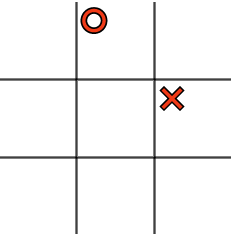

# DOM project

En aquesta activitat crearàs un joc el DOM, HTML i CSS.

## Objectius

- Manipular el DOM directament, afegint i eliminant elements.
- Fer servir CSS per donar estils als elements de la pàgina.
- Afegir gestors d'esdeveniments (event handlers) per interactuar amb les accions que l'usuari faci a la pàgina.
- Gestionar les dades del joc de manera ordenada i estructurada, separades de la visualització
- Implementar la lògica de funcionament del joc de manera ordenada i estructurada, dividint el codi en tantes funcions com calgui.
- Separar la lògica de funcionament del codi de la visualització.

## Configuració

- `npm install` per instal·lar Tailwind CSS.
- `npm start` per a inicialitzar el compilador de Tailwind CSS.
- Obre `index.html` al navegador amb el Live Server de VS Code.

## Requisits bàsics

- Escull un dels següents jocs i desenvolupa'l utilitzant tot el que has après de HTML, CSS, JavaScript i el DOM.
- Si ho prefereixes, pots fer un altre joc que no estigui en aquesta llista

### Tres en ratlla

### 1. Estila el taulell

- [ ] Afegeix el CSS necessari

  - El taulell hauria d'estar centrat a la pàgina
  - Treu els costats innecessaris
  - Aproxima't el que puguis al clàssic taulell de tres en ratlla
    

- [ ] Afegeix contingut al taulell

  - Utilitza pseudoelements per afegir X i O a les caselles
  - Haurien d'estar el més centrats possible
  - In the input.css file, you have the following:

        .x::after {
          content: "?";
        }
        .o::after {
          content: "?";
        }

    Please, replace this in the way it looks like the image bellow.

    

        .x::after {
          content: "❌";
        }
        .o::after {
          content: "⭕";
        }

    This means every time we apply a class of .x or .o to one of the cells, it will be marked. However, if we do so, they don't look quite right.

- [ ] Centralize icons ❌ and ⭕

  - Add css style in order for the items to be centralized and bigger.

    

- [ ] Test if your `CSS` is working properly
      

### 2. Add functionality

- [ ] Make your game looking like the image bellow

  - Schedule a click event on the grid to mark the boxes
  - Add necessary checks (draw, winner)
  - Add CSS to make the cell disabled after the click

Reminder: all the interactivity and functionalities will be done using JavaScript functions.


- Create a button written <button>restart</button> with HTML
- Make the reset button functional

- [ ] Create the game

  Now let's focus our attention on actually creating the game itself. We have the board, we have it styled, let's add the logic. First, we want to define an object for storing the state of our game:

  ```js const game = {
      xTurn: true,
      xState: [],
      oState: [],
      winningStates: [
          // Rows
          ['0', '1', '2'],
          ['3', '4', '5'],
          ['6', '7', '8'],

          // Columns
          ['0', '3', '6'],
          ['1', '4', '7'],
          ['2', '5', '8'],

          // Diagonal
          ['0', '4', '8'],
          ['2', '4', '6']
      ]
  }
  ```

This object will hold 4 different properties:

1. `xTurn`, a flag to switch between turns
2. `xState`, the state of X, represented with an array of strings
3. `oState`, the state of Y, represented in the same way
4. `winningStates`, the possible combinations to win the game.

How did we get the possible combinations? Based on those values, we can list the possible winning states here. We will match this against `xState` and `oState` later on to see who is winning the game.

### 3. Style the 'endgame' screen


- Create a h1 tittle with HTML and add on your code the possible results based on the matches
- Make sure the reset button appears at the end of the game

## Recursos

- [MDN - Manipulating the DOM Guide](https://developer.mozilla.org/en-US/docs/Learn/JavaScript/Client-side_web_APIs/Manipulating_documents)
- [Plain JS - Common DOM Manipulation methods](https://plainjs.com/javascript/manipulation/)
- [Eloquent JavaScript - The DOM](https://eloquentjavascript.net/14_dom.html)
- [Eloquent JavaScript - Handling Events](https://eloquentjavascript.net/15_event.html)

## Notes

_Aquest és un projecte d'estudiant creat a [CodeOp](http://CodeOp.tech), al bootcamp de Front End Development a Barcelona._
